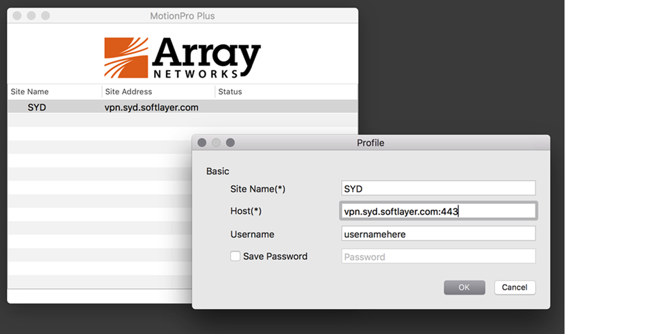

---

copyright:
  years: 1994, 2021
lastupdated: "2021-06-21"

keywords: Standalone VPN clients, Virtual Private Network, MotionPro

subcollection: iaas-vpn

---

{:shortdesc: .shortdesc}
{:new_window: target="_blank"}
{:codeblock: .codeblock}
{:pre: .pre}
{:screen: .screen}
{:term: .term}
{:tip: .tip}
{:note: .note}
{:important: .important}
{:deprecated: .deprecated}
{:external: target="_blank" .external}
{:generic: data-hd-programlang="generic"}
{:download: .download}
{:DomainName: data-hd-keyref="DomainName"}
{:term: .term}

# Connecting to SSL VPN from MotionPro clients (Windows, Linux, and Mac OS X)
{: #standalone-vpn-clients}

## Windows standalone client
{: #windows-standalone-client}

1. When you [log in to SSL VPN](docs/iaas-vpn?topic=iaas-vpn-getting-started) using the web browser, the compatible version of MotionPro client is available for you to download.
2. Install and set up MotionPro:
   1. Run MotionProSetup to install the software.
   2. Run the MotionPro Setup Wizard. Then, click the MotionPro icon on your desktop and select **Profile > Add**.
   3. To create a profile, enter a Site Name (domain name or IP address) and Host (select from available [VPN endpoints](/docs/iaas-vpn?topic=iaas-vpn-available-vpn-endpoints)). Next, enter your VPN username and password and click **Save**.
   4. Double-click the profile that you created to connect to the VPN.

If you have issues, uninstall any Array programs by using the Windows Control Panel, restart, and then reconnect.

MotionPro does not work on Windows 8 RT.
{:note}

## Linux standalone client
{: #linux-standalone-client}

1. When you [log in to SSL VPN](docs/iaas-vpn?topic=iaas-vpn-getting-started) using the web browser, the compatible version of MotionPro client is available for you to download.

2. Make it executable. For example: `chmod +x MotionPro_Linux_Ubuntu_x86-64_1.2.3.sh`

3. Run the script to install. For example:  `./MotionPro_Linux_Ubuntu_x86-64_1.2.3.sh`

  * Usage:  `./MotionPro --host [site] --user [username] --passwd [password]`
  * To stop it:  `[control-c]`

4. Enable `rc.local`, if needed. For example:

  ```
     # If you are using systemd, you might not have the /etc/rc.local file, and you will get an "Auto start script file was not found in system!" error.
     # Make an empty one. systemd will know what to do with it
     # <https://askubuntu\.com/a/919598>

     $ printf '%s\n' '#!/bin/bash' 'exit 0' | sudo tee -a /etc/rc.local
     $ sudo chmod +x /etc/rc.local

     # Try installing again
     $ sudo ./MotionPro_Linux_Ubuntu_x86-64_1.2.3.sh
```     

To start the MotionPro client, you must input at least the `hostname` and `username` as arguments. `Site` can be either a domain name or an IP address.
{:tip}

## Mac OS X 10.10 standalone client
{: #macos-standalone-client}

MacOS 10.11 is not supported.
{:note}

1. When you [log in to SSL VPN](docs/iaas-vpn?topic=iaas-vpn-getting-started) using the web browser, the compatible version of MotionPro client is available for you to download.
2. Locate the MotionPro Plus client under the **Applications** folder and open the application.
2. Click **Profile**, then **Add**.
3. Fill in the Site Name, Host, and Username information, then click **OK**.
4. Click **VPN** in the upper left, then **Connect**.

For example:



If the tunnel isn't directing traffic correctly, you might need to [add routes manually](https://discussions.apple.com/thread/2735376){: external}.

Uninstall any previous versions of the client before you install a new version.
{:important}
